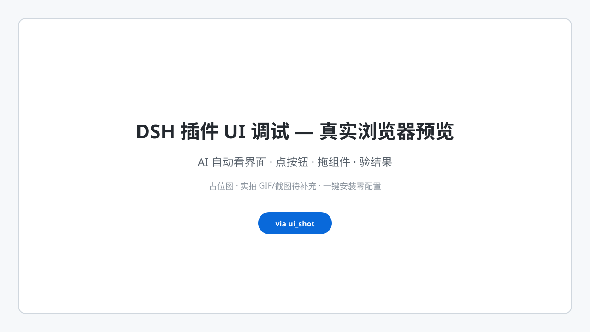

# @feather_wch/dsh-plugin-ui-debug

[](https://www.npmjs.com/package/@feather_wch/dsh-plugin-ui-debug) [](https://github.com/topics/dsh-plugin) [](https://playwright.dev)

**DSH 插件 UI 调试闭环工具** — 给开发/测试 DSH 插件的 AI 提供「真实 Chrome (Playwright) 驱动 + UI 查看/测试/验证/问题解决」全套能力。

## 一条命令完成安装

需要 **DSH CLI**（DeepSeek Harness 命令行工具）。如果还没有，先安装：

```bash
npm install -g @deepseek-ai/dsh
```

然后把插件装进你的 profile：

```bash
dsh plugin --profile web add @feather_wch/dsh-plugin-ui-debug
```

安装即完成，**零配置**：本插件采用 DSH 官方 bundle 机制——包内自带 `cordis.patch.yml`（声明 `dsh.bundle.patch`），`dsh plugin add` 装完后自动把插件加入 profile 的 `dsh.profile.bundles` 层栈，DSH 启动时直接装配；`dsh plugin remove` 卸载时自动移除。全程无需手动编辑任何文件。重启 DSH（或刷新浏览器页面）即生效，插件自动注册 `dsh-plugin-ui-debug` skill 和 `ui_shot` / `ui_drive` 工具。

## 预览



> 实拍：AI 在真实 Chrome 中自动看界面、点按钮、拖组件 → 截图对比验证 → 改代码 → 二次验证。GIF/真图待补充，此 SVG 占位确保首屏不裂图且一键安装不受影响；完整方法论见 Skill（`dsh-plugin-ui-debug`）中的 sizing-probe / 分段拖拽案例。

## 升级

```bash
dsh plugin --profile web update @feather_wch/dsh-plugin-ui-debug
```

等价幂等重装：

```bash
dsh plugin --profile web add @feather_wch/dsh-plugin-ui-debug
```

需要钉回历史版本：`dsh plugin --profile web add @feather_wch/dsh-plugin-ui-debug@<版本>`。

> 安装本插件后，**自动注册同名 skill（`dsh-plugin-ui-debug`）**，任何 session 的 AI 在调试 DSH 插件 UI 时都会自动获得这套方法论（激活会话 → hit-test → 分段拖拽 → DOM 断言 → sizing-probe → 犹豫留证），无需任何手工配置。

## 它解决什么

DSH 插件（面板 / dock / tabs / 弹窗 / 布局 / 交互）的 UI bug，AI 需要真实打开浏览器去看、去点、去拖、去读 DOM 数值才能定位和验证。本插件提供：

- **`ui_shot`** — 截图任意 http(s) 页面（含运行中的 DSH GUI），PNG 落盘，供 view_image 视觉确认。
- **`ui_drive`** — 动作脚本驱动页面（导航/点击/输入/按键/滚动/拖拽/分步截图/JS 求值），用于 UI 调试与断言。
- **`dsh-plugin-ui-debug` skill** — 随插件自动注册的调试方法论（含已验证的坑与最佳实践）。

## 双产物设计

| 产物 | 形态 | 作用 |
|---|---|---|
| Plugin | host 工具插件（`ui_shot` / `ui_drive`） | AI 的"手"——真实驱动浏览器 |
| Skill | 随 `apply()` 用 `ctx.skills.register()` 原生注册 | AI 的"脑"——知道怎么用、有什么坑 |

两个产物在同一源码仓库，随包分发。skill 通过 DSH 原生 runtime skill 注册机制注入，**零文件写入、零本机路径硬编码**，装到任何机器都自动生效。

## 本地开发安装

```bash
# 方式 1：本地构建注入（开发期）
cd dsh-plugin-ui-debug
# 构建（依赖 bash + node）：scripts/build.sh（tsc 编译 + 复制 skill 资源到 lib/skill）
bash scripts/build.sh
# 注入器环境内
dev_inject_plugin <本目录>
```

```bash
# 方式 2：本地 tgz 安装（发版前自测 DSH bundle 机制）
npm pack
dsh plugin --profile web add ./feather_wch-dsh-plugin-ui-debug-0.0.1.tgz
```

## 构建链说明

本机无 dsh 源码 checkout 时的构建（npm 装依赖报 edgesOut 坏图时）：

```bash
corepack pnpm add -D typescript@^5.9 @types/node@^24 tsdown@^0.22.14 playwright-core@^1.62.1
# 把 agent 的 @deepseek-ai/* junction 到 node_modules/@deepseek-ai 供 tsc 解析类型
node node_modules/typescript/bin/tsc -p tsconfig.json
# 复制 skill 资源（tsc 不复制 .md，build.sh 已含此步）
mkdir -p lib/skill && cp src/skill/*.md lib/skill/
```

## 目录结构

```
dsh-plugin-ui-debug/
├── package.json          # @feather_wch/dsh-plugin-ui-debug
├── cordis.patch.yml      # DSH bundle 声明（dsh.bundle.patch）
├── src/
│   ├── index.ts          # 插件入口：注册 ui_shot/ui_drive 工具 + ctx.skills.register()
│   ├── cdp.ts            # 零依赖 CDP 引擎（Node 22 WebSocket，attach/launch）
│   └── skill/
│       └── dsh-plugin-ui-debug.md   # skill 正文（打包到 lib/skill/）
├── scripts/              # 验证/调试脚本（poc-*、playwright-flow3 等）
└── lib/                  # 构建产物（含 lib/skill/）
```

## License

BSD-3-Clause（见 LICENSE）。
